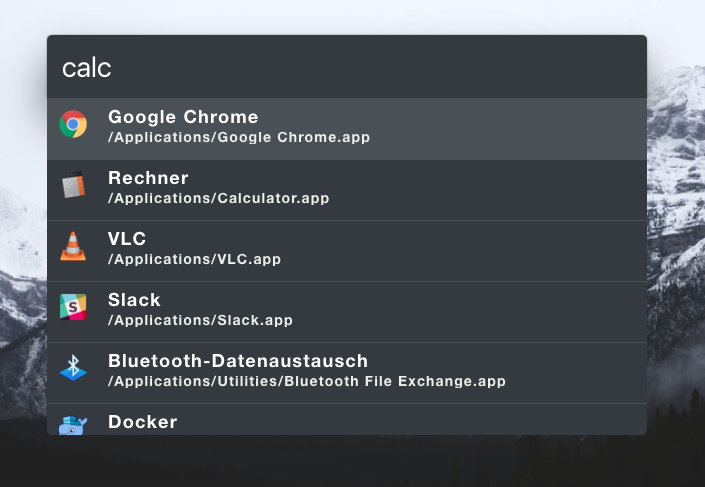

# Zazu Monochrome Theme

[](https://travis-ci.org/chrishelgert/zazu-monochrome-theme)
[](https://greenkeeper.io/)

> A monochrome theme for [Zazu](https://github.com/tinytacoteam/zazu).



## Install

Add `chrishelgert/zazu-monochrome-theme` to your theme block inside your `.zazurc.json` file.

```json
{
  "theme": ["chrishelgert/zazu-monochrome-theme"]
}
```

## Contributing

1. Fork it
2. Create your feature branch
3. Commit your changes
4. Push to the branch
5. Create new Pull Request

## LICENSE

Copyright (c) 2017 Chris Helgert. See [License](./LICENSE) for details.
